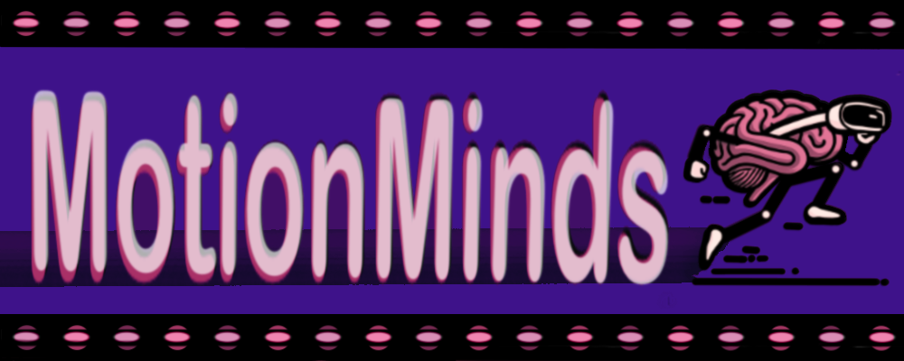

<div align="center">

## Introduction ✨

MotionMinds was created from a deep understanding of the challenges faced by individuals with disabilities. As developers who share similar experiences, we know the importance of tools that support both daily tasks and emotional well-being.

**MotionMinds** is more than an app—it’s a companion designed to offer comfort, empowerment, and a sense of control.

With tracking tools and an AR relaxation environment, our platform aims to help users feel supported and in control of their well-being. Our vision is to foster a community where challenges are met with resilience and hope.

Our slogan is, **"Unlock Your Potential, One Motion at a Time,"** embodying our belief that great things can be accomplished step by step, with persistence leading to continuous improvement.

</div>

---

<div align="center">

## Table of Contents 📚

</div>

- [✨ Introduction ✨](#introduction-)
  
- [📋 Project Overview 📋](#project-overview-)
  
- [🛠 Technologies Used 🛠](#technologies-used-)
  
- [🚀 Features 🚀](#features-)
  
- [🔮 Future Plans 🔮](#future-plans-)
  
- [⚙️ Setup and Running the App ⚙️](#setup-and-running-the-app-)
  
- [👥 Contributors 👥](#contributors-)
  
- [📜 License 📜](#license-)

---

<div align="center">

## Project Overview 📋

</div>

**MotionMinds** is a web application that combines productivity tools with wellness support, created specifically for individuals with disabilities. The project currently includes:

- **Task Management**: Create, read, update, and delete tasks, filter tasks by date, and manage their completion status.
- **Mood Tracker**: Track moods with three options: happy, numb, and sad. This feature is designed for potential future expansion.
- **AR Relaxation Space**: Offers a calming environment where users can de-stress through guided AR experiences.
- **User Authentication**: Session-based authentication ensures user data is secure.
- **Responsive UI**: Interactive elements ensure an engaging user experience.

---

<div align="center">

## Technologies Used 🛠

</div>

### **Front-End**
- **HTML & CSS**: For building and styling the user interface.
- **JavaScript**: For adding dynamic behaviors and user interaction.
- **React**: For component-based UI development.

### **Back-End**
- **Node.js**: JavaScript runtime for server-side development.
- **Express.js**: A minimalist framework for routing and handling HTTP requests.
- **MongoDB**: NoSQL database for storing user data and tasks.

### **AR/VR**
- **A-Frame**: A framework for building 3D and VR web experiences using simple HTML-like tags, compatible with WebXR and three.js.
- **WebXR**: Enables VR and AR experiences in browsers, supporting various devices and handling 3D rendering.
- **Three.js**: A JavaScript library for 3D graphics in browsers, built on WebGL and often used with A-Frame.

---

<div align="center">

## Features 🚀

</div>

### **Current Features**
- **Task Management**: 
  - Create, read, update, and delete user-specific tasks.
  - Filter tasks by date and manage completion statuses.
  - Bulk addition of predefined task entries.
- **Mood Tracker**: 
  - Track your mood with three emotion options: happy, numb, and sad.
- **AR Relaxation Space**: 
  - A calming space that helps users de-stress through guided AR experiences.
- **User Authentication**: 
  - Session-based authentication for secure user operations and data protection.
- **Responsive UI**: 
  - Interactive elements built with JavaScript for an engaging user experience.

---

<div align="center">

## Future Plans 🔮

</div>

1. Expand AR and VR capabilities for guided motor therapy and exercise routines.
2. Develop a tracking system to monitor and analyze user progress in motor therapy with a daily score ranging from 0 to 100.
3. Implement professional crisis support features for emergency assistance with mental health providers.
4. Develop medical appointment reminders and additional health tracking systems.
5. Subdivided areas of health monitoring to cover different user needs.
6. Create a provider portal for tracking patient progress:
   - Include patient feedback notes on medication effects, marked as "positive" or "negative."
   - Add a dedicated space for patients to document specific effects they experience.
   - Add a feature for users to attach medications, track side effects, and view brief explanations of each medication's purpose and potential side effects.
7. Integrate period (menstrual) tracking and task management tools tailored for women with PMS.
8. Introduce a sleep tracker for individuals with insomnia to monitor sleep patterns and duration.
9. Explore additional health monitoring tools:
   - Hydration tracking with reminders and intake recording.
   - Enhanced mood tracking to capture daily variations and potential triggers.
   - Exercise monitoring for consistent movement and fitness.
10. Enhance accessibility features with alarms, voice commands, and audio cues for users with disabilities.
11. Develop data visualization tools for comprehensive tracking of wellness and productivity.

---

<div align="center">

## Setup and Running the App ⚙️


**Prerequisites**
Ensure you have Node.js and npm installed.

</div>

**Running the Back-End**

```bash
# Navigate to the api/ directory
cd path/to/motionminds/api

# Install dependencies
npm install

# Run the server (development mode)
npm run dev
```

**Running the Front-End**

```bash
# Navigate to the client/ directory
cd path/to/motionminds/client

# Install dependencies
npm install

# Start the development server
npm run dev
```

**Example Commands for Two-Terminal Setup**

```bash
Terminal 1 (Back-End):

cd path/to/motionminds/api
npm install
npm run dev
```
```bash
Terminal 2 (Front-End):

cd path/to/motionminds/client
npm install
npm run dev
```
```bash
Database Setup

Ensure MongoDB is running locally or replace the connection string with a cloud-based MongoDB URI in the config.js file.

```
---

<div align="center">
  
## Contributors 👥

</div>Sheila Gomez: Lead front-end developer using HTML, CSS, JavaScript, React, and Procreate. Responsible for creating user interfaces, logo art, and documentation.

Luis Soto: AR developer using A-Frame, WebXR, and JavaScript (Three.js). Developed the landing page using HTML/CSS.

Jeremy: Back-end developer using Node.js, Express.js, MongoDB, and React. Collaborated on front-end integration and development.


---

<div align="center">
  
  ## License 📜

</div>

This project is licensed under the Apache License 2.0.
